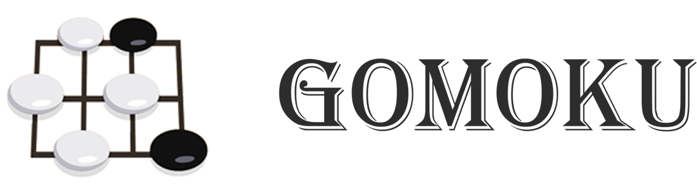
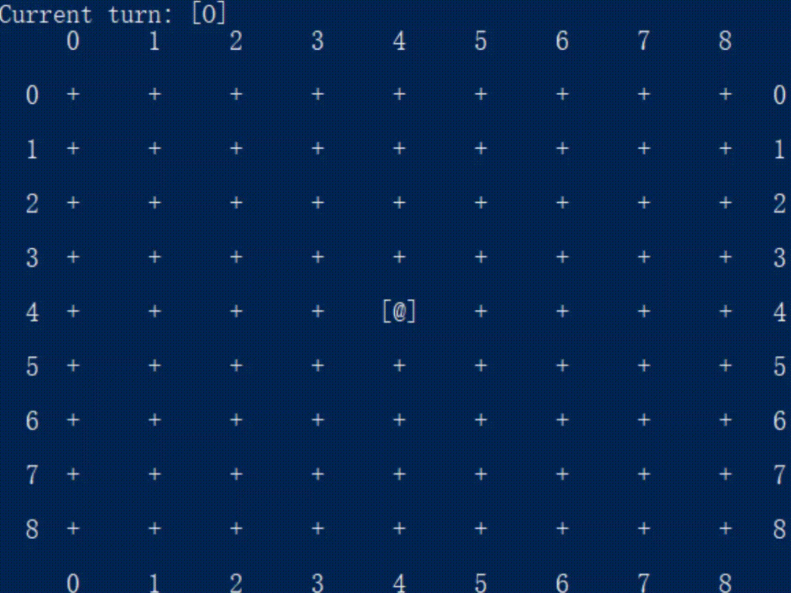

# GOMOKU #

## Introduction ##

This [Gomoku][gomoku_intro](also called Gobang or Five-in-a-row) program is an implementation of the reinforcement learning algorithm which combines the [Monte Carlo Tree Search][MCTS_wiki] together with Deep Neural Networks. This method is a "pure" reinforcement learning method which need no human knowledges about Gomoku game. This method was introduced by [DeepMind][deepmind] and was used in the famous Go game engine [AlphaGo-Zero][alphago_zero]. This project also contains a pure MCTS version Gomoku game engine implemented by C++.

* A Gomoku Game between two pure MCTS AI player.



## Usage ##

There are two different engines in this project, one is implemented using Python and the other is implemented using C++. 

The Python version is slower by support DNN currently. The C++ version is much faster than the Python version but not support DNN for now.

#### Requirements ####

To use the Gomoku game engine with DNN, which is implemented with Python, you need:

* Python >= 3.6
* Numpy >= 1.14
* TensorFlow >= 1.1
* six

To use the C++ version program, you need a C++ compiler which supports C++11.

#### Getting Started(Python Version) ####

To start a game with computer using the Python version engine, just modify the `mcts_demo.py` script directly and run it with Python3. Here is an example:
```Python
import sys
sys.path.extend(['./src'])

from pygomoku.Board import Board
from pygomoku.Player import HumanPlayer, PureMCTSPlayer
from pygomoku.GameServer import GameServer

board = Board(width=9, height=9)

player1 = PureMCTSPlayer(Board.kPlayerBlack, name="AI 1",weight_c=5, compute_budget=20000)

player2 = HumanPlayer(Board.kPlayerWhite, name="player 2")

server = GameServer(board, GameServer.kNormalPlayGame, player1, player2)

server.startGame()
```

Currently it supports `PureMCTSPlayer`, `HumanPlayer` and `DNNMCTSPlayer`. But if you want to use `DNNMCTSPlayer`, first you need to train a model for it.

To train a model for the engine, you need to set the parameters in a JSON file and pass it to the train server. You can find an example in `train_demo.py` and `test_config.json`.

#### Getting Started(C++ Version) ####

Just run `make` in the project directory and you will find `pure_mcts_game` in the `bin/cppgomoku` directory. To use it you need to provide two player type parameters to it ('h' for human and 'c' for computer player). Here is an example:
```
./pure_mcts_game c c
```

The first player is the one using black stone and the second one using white stone.

## TODO list ##

* Try to find a better model for `DNNMCTSPlayer`.
* Add DNN support for C++ version engine.

## Acknowledgment ##

Thanks to junxiaosong's [project][other_proj], I learnt a lot from it.

<!-- outer links -->
[gomoku_intro]: https://en.wikipedia.org/wiki/Gomoku

[MCTS_wiki]: https://en.wikipedia.org/wiki/Monte_Carlo_tree_search

[deepmind]: https://deepmind.com/

[alphago_zero]: https://www.nature.com/articles/nature24270

[other_proj]: https://github.com/junxiaosong/AlphaZero_Gomoku
